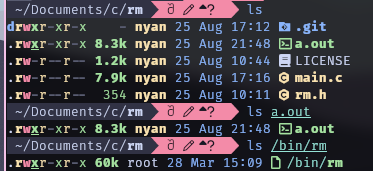

# Another RM

This is the repository for Another RM, short for ARM (no, not the objectively superior architecture).

It is marginally smaller than GNU rm, so this is a great candidate for anybody who has a size constraint.

## Prove it

~722.89% smaller than GNU rm.

compile flags `tcc main.c -Oz -ffunction-sections -fdata-sections -flto -fwhole-program`

## Building

For optimal results, use tcc instead of gcc or clang. those compilers create gigantic executables.

